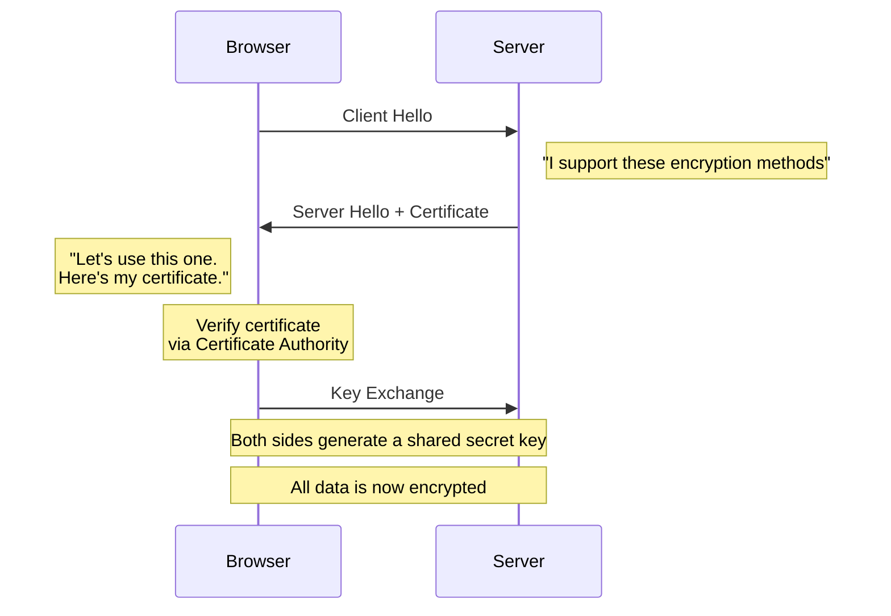
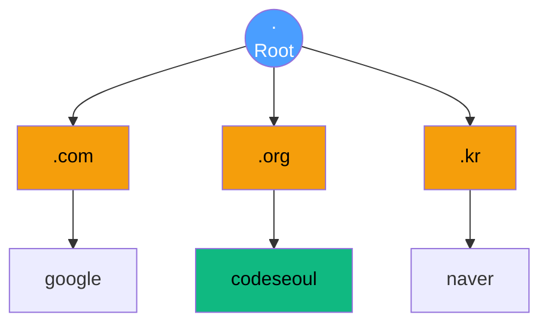
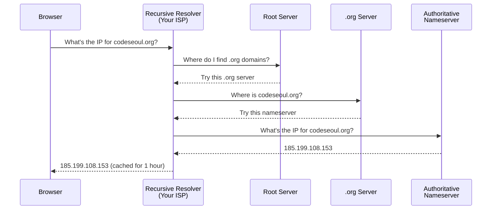
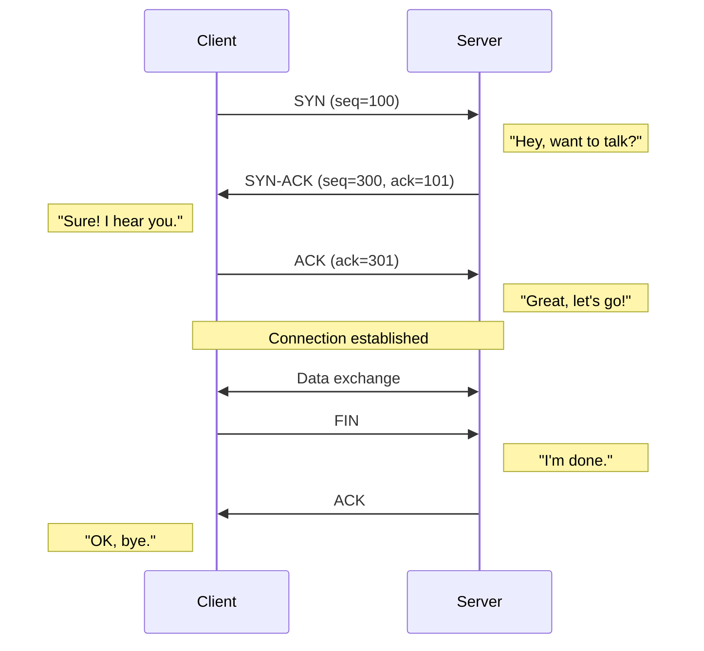
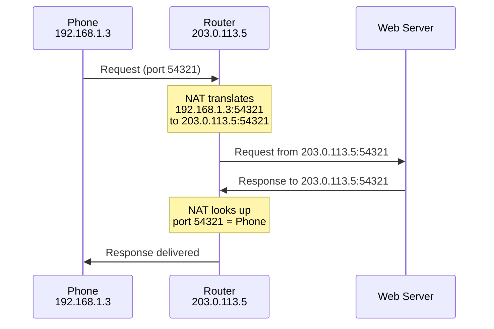
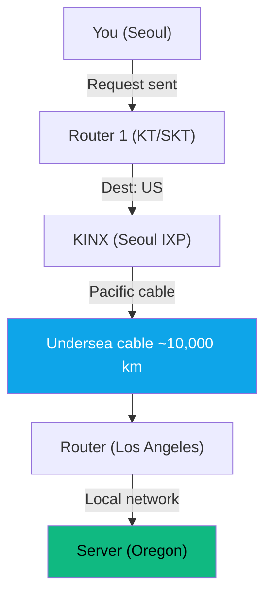
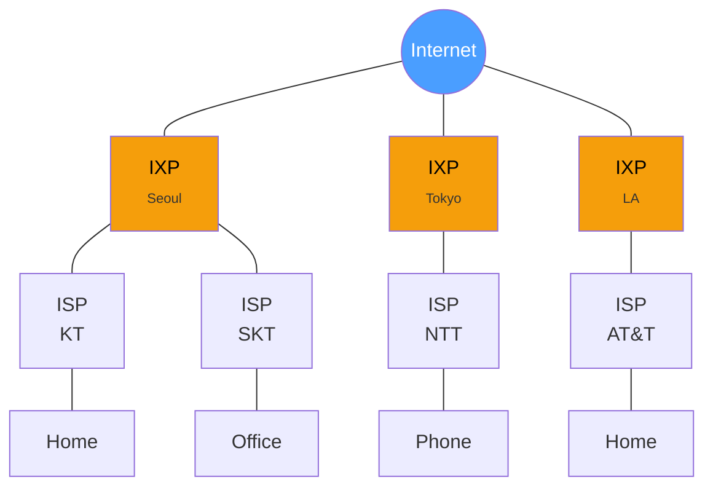
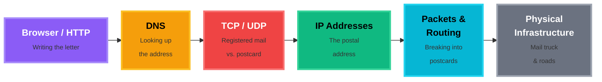

# How Does the Internet Work?

From clicking a link to loading a page — what actually happens?

<div class="pt-12">
  <span class="px-2 py-1 rounded cursor-pointer" hover="bg-white bg-opacity-10">
    CodeSeoul
  </span>
</div>

---
layout: center
class: text-center
---

# You type `codeseoul.org` and press Enter.

<br>

<div class="text-2xl opacity-80">

What happens in the next **500 milliseconds**?

</div>

<br>

<v-click>

Let's trace the journey — starting from what you can see, all the way down to the wires.

</v-click>

---

# The Journey Down

We'll start where you are — at the browser — and go deeper, one layer at a time.

<div class="mt-2">


</div>

---
layout: section
---

# Act 1
## What the Browser Does

Let's start with what you can already see.

---

# What Happens When You Press Enter?

You've typed `codeseoul.org` into the address bar and hit Enter. The browser immediately starts working:

<div class="grid grid-cols-3 gap-3 mt-4">
<v-clicks>
  <NumberCard :number="1" title="Checks its cache" color="green">
    "Have I been to this site recently? Do I already know the answer?"
  </NumberCard>
  <NumberCard :number="2" title="Builds an HTTP request" color="blue">
    A structured message asking the server for a page
  </NumberCard>
  <NumberCard :number="3" title="But first... find the server" color="amber">
    It only has a name, not an address
  </NumberCard>
</v-clicks>
</div>

<v-click>
<TipBox>Let's look at each of these steps, starting with the message itself.</TipBox>
</v-click>

---

# HTTP — The Browser's Language

**HyperText Transfer Protocol** — how your browser talks to web servers.

<br>

<v-clicks>

- Every time you load a page, your browser sends an **HTTP request**
- The server sends back an **HTTP response**
- It's a simple conversation: *"Can I have this page?" → "Sure, here it is."*

</v-clicks>

---

# Anatomy of an HTTP Request

This is what your browser actually sends to the server:

```http
GET /meetups HTTP/1.1
Host: codeseoul.org
Accept: text/html
User-Agent: Chrome/120
```

<v-clicks>

- **`GET`** — the action (I want to retrieve something)
- **`/meetups`** — the path (which page)
- **`Host: codeseoul.org`** — which server
- **`User-Agent`** — who's asking (your browser)

</v-clicks>

---

# Anatomy of an HTTP Response

And this is what the server sends back:

```http
HTTP/1.1 200 OK
Content-Type: text/html
Content-Length: 4523

<!DOCTYPE html>
<html>
  <head><title>CodeSeoul Meetups</title></head>
  <body>...</body>
</html>
```

<v-clicks>

- **`200 OK`** — status code (success!)
- **`Content-Type`** — what kind of data (HTML, JSON, image...)
- The **body** — the actual page content

</v-clicks>

---

# HTTP Methods (Verbs)

How you tell the server **what you want to do**.

<div class="grid grid-cols-3 gap-3 mt-4">
  <InfoCard title="GET" color="green" icon="📥">Retrieve data — Load a webpage</InfoCard>
  <InfoCard title="POST" color="blue" icon="📤">Submit/create data — Submit a signup form</InfoCard>
  <InfoCard title="PUT" color="amber" icon="🔄">Update (replace) data — Replace your profile</InfoCard>
  <InfoCard title="PATCH" color="purple" icon="✏️">Update (partial) data — Change just your email</InfoCard>
  <InfoCard title="DELETE" color="red" icon="🗑️">Remove data — Delete a comment</InfoCard>
</div>

---

# HTTP Status Codes

How the server tells you **what happened**.

<div class="grid grid-cols-3 gap-3 mt-4">
  <InfoCard title="200" color="green" icon="✅">OK — here's what you asked for</InfoCard>
  <InfoCard title="301" color="blue" icon="↪️">Moved permanently — go here instead</InfoCard>
  <InfoCard title="403" color="amber" icon="🚫">Forbidden — you're not allowed</InfoCard>
  <InfoCard title="404" color="red" icon="❓">Not found — doesn't exist</InfoCard>
  <InfoCard title="500" color="red" icon="💥">Server error — something broke on our end</InfoCard>
  <InfoCard title="418" color="purple" icon="🫖">I'm a teapot</InfoCard>
</div>

<v-click>
<TipBox variant="fun">
<b>418 I'm a Teapot</b> is a real HTTP status code from an April Fools' RFC. It means the server refuses to brew coffee because it is, in fact, a teapot.
</TipBox>
</v-click>

---

# HTTPS — The Lock Icon

**HTTPS** wraps HTTP in **TLS** (Transport Layer Security) encryption.

<CompareBox leftTitle="Without HTTPS" rightTitle="With HTTPS" leftIcon="🔓" rightIcon="🔒" leftColor="red" rightColor="green" class="mt-6">
  <template #left>
    <div class="text-center text-2xl my-3"><code>"password123"</code></div>
    <div class="text-center text-sm opacity-70">Anyone on the network can read this!</div>
  </template>
  <template #right>
    <div class="text-center text-2xl my-3"><code>"k8$#f!x@..."</code></div>
    <div class="text-center text-sm opacity-70">Encrypted — completely unreadable!</div>
  </template>
</CompareBox>

<TipBox variant="warning">Always check for the lock icon in your browser! No lock = your data is visible to anyone on the network.</TipBox>

---

# The TLS Handshake (simplified)

How your browser and the server establish a secure connection.



<v-click>
<TipBox>This all happens in milliseconds, before any webpage content is sent.</TipBox>
</v-click>

---
layout: section
---

# The browser knows *what* to say...

## But *where* does it send it?

The browser has a name — `codeseoul.org` — but it needs a number.

---
layout: section
---

# Act 2
## Finding the Server

DNS — the Internet's contacts app.

---

# Nobody Remembers IP Addresses

**DNS** (Domain Name System) translates human-readable names into IP addresses.

<br>

```
codeseoul.org  →  DNS lookup  →  185.199.108.153
```

<br>

Without DNS, you'd have to type `185.199.108.153` into your browser every time.

---

# The DNS Hierarchy

DNS is organized like a tree, starting from the root.



<v-clicks>

- **Root servers** — 13 sets of servers that know where to find everything
- **TLD servers** — manage `.com`, `.org`, `.kr`, etc.
- **Authoritative servers** — have the final answer for a specific domain

</v-clicks>

---

# How a DNS Lookup Works

What happens when your browser asks "What's the IP for `codeseoul.org`?"



---

# DNS Caching — Your Browser Remembers

That full lookup doesn't happen every time. Answers get **cached** at multiple levels:

<br>

<div class="grid grid-cols-2 gap-3 mt-2">
<v-clicks>
  <NumberCard :number="1" title="Browser cache" color="green">Chrome remembers the answer for minutes</NumberCard>
  <NumberCard :number="2" title="Operating system cache" color="blue">Your computer keeps its own copy</NumberCard>
  <NumberCard :number="3" title="ISP resolver cache" color="amber">Your ISP remembers answers for thousands of users</NumberCard>
  <NumberCard :number="4" title="Full lookup" color="red">Only if all caches miss does Root → TLD → Authoritative happen</NumberCard>
</v-clicks>
</div>

<br>

<v-click>
<TipBox>This is why the first visit to a website can feel slower than the second — by the second time, the answer is already cached.</TipBox>
</v-click>

---

# Common DNS Record Types

<div class="grid grid-cols-2 gap-3 mt-2">
  <InfoCard title="A" color="green" subtitle="Domain → IPv4 address"><code>codeseoul.org → 185.199.108.153</code></InfoCard>
  <InfoCard title="AAAA" color="blue" subtitle="Domain → IPv6 address"><code>google.com → 2607:f8b0:4004:...</code></InfoCard>
  <InfoCard title="CNAME" color="amber" subtitle="Domain → another domain (alias)"><code>www.example.com → example.com</code></InfoCard>
  <InfoCard title="MX" color="purple" subtitle="Mail server for the domain"><code>codeseoul.org → mail.google.com</code></InfoCard>
</div>

<v-click>
<TipBox icon="🔍">You can look these up yourself with <code>dig codeseoul.org MX</code> or <code>nslookup -type=MX codeseoul.org</code></TipBox>
</v-click>

---

# DNS in Action

```bash
# Try this at home!
$ nslookup codeseoul.org
Server:  dns.google
Address: 8.8.8.8

Name:    codeseoul.org
Address: 185.199.108.153

# Or dig for more detail
$ dig codeseoul.org

;; ANSWER SECTION:
codeseoul.org.    3600    IN    A    185.199.108.153

# TTL = 3600 seconds (1 hour) — how long to cache this answer
```

---
layout: section
---

# DNS gave us an IP address.

## Now the browser needs to open a connection. But how?

---
layout: section
---

# Act 3
## Making a Reliable Connection

TCP & UDP — registered mail vs. shouting across a room.

---

# TCP — Reliable Delivery

**Transmission Control Protocol** — the careful postal service.

<br>

<v-clicks>

- Three-way handshake before any data is sent (SYN → SYN-ACK → ACK)
- Guarantees **all data arrives**
- Guarantees **correct order**
- Automatically **retransmits** lost packets
- Slower, but dependable

</v-clicks>

<br>

<v-click>

**Used for:** Web browsing, email, file transfer, APIs — anything where missing data would be a problem.

</v-click>

---

# The TCP Handshake



This happens every time you open a web page — in about **~1ms** on a local network.

---

# UDP — Speed Over Reliability

**User Datagram Protocol** — the "just throw it and hope" approach.

<br>

<v-clicks>

- No handshake — just start sending
- No guarantee of delivery
- No guarantee of order
- No retransmission of lost packets
- **Fast** and lightweight

</v-clicks>

<br>

<v-click>

**Used for:** Video streaming, gaming, VoIP, DNS lookups — where speed matters more than perfection.

</v-click>

---

# TCP vs UDP — The Analogy

<CompareBox leftTitle="TCP" rightTitle="UDP" leftIcon="📞" rightIcon="📢" leftColor="blue" rightColor="amber" class="mt-4">
  <template #left>
    <div class="text-sm">Like a <b>phone call</b> — you establish a connection, confirm the other person is there, and have a back-and-forth conversation.</div>
  </template>
  <template #right>
    <div class="text-sm">Like <b>shouting across a room</b> — fast, but you might miss something.</div>
  </template>
</CompareBox>

<v-click>
<TipBox icon="🤔" color="purple">Which one would you use for a bank transfer? For a live video call?</TipBox>
</v-click>

---

# TCP vs UDP — Comparison

<CompareBox leftTitle="TCP" rightTitle="UDP" leftColor="blue" rightColor="amber" class="mt-4">
  <template #left>
    <div class="text-sm space-y-2">
      <div><b>Connection:</b> Handshake first</div>
      <div><b>Reliability:</b> Guaranteed delivery</div>
      <div><b>Speed:</b> Slower</div>
      <div><b>Order:</b> Guaranteed</div>
      <div><b>Example:</b> Loading this webpage</div>
    </div>
  </template>
  <template #right>
    <div class="text-sm space-y-2">
      <div><b>Connection:</b> No handshake</div>
      <div><b>Reliability:</b> Best effort</div>
      <div><b>Speed:</b> Faster</div>
      <div><b>Order:</b> Not guaranteed</div>
      <div><b>Example:</b> Watching a YouTube stream</div>
    </div>
  </template>
</CompareBox>

---
layout: section
---

# TCP uses IP addresses to find the destination.

## But what *are* IP addresses?

---
layout: section
---

# Act 4
## Addressing Every Device

IP addresses — the Internet's postal system.

---

# What Is an IP Address?

An **IP address** is a unique identifier for a device on a network — like a **postal address** for a computer.

<br>

<v-clicks>

- Every device on the Internet needs one to send and receive data
- Just like a postal address tells the mail carrier where to deliver, an IP address tells the network where to send packets
- There are two versions: **IPv4** (the original) and **IPv6** (the new one)

</v-clicks>

---

# IPv4 — The Original Address System

<br>

```
192.168.1.1
```

<br>

<v-clicks>

- 4 groups of numbers, each 0–255
- ~4.3 billion possible addresses
- Designed in the 1980s — seemed like plenty at the time

</v-clicks>

---

# We Ran Out!

**4.3 billion addresses** sounded like a lot...

<br>

<v-clicks>

- But there are now **5.5 billion** Internet users
- Plus phones, tablets, smart TVs, IoT devices, servers...
- IPv4 addresses were **officially exhausted in 2011**
- We needed a new system.

</v-clicks>

---

# IPv6 — The New Address System

Designed to solve the address shortage — with room to spare.

<br>

```
2001:0db8:85a3:0000:0000:8a2e:0370:7334
```

<br>

<v-clicks>

- 8 groups of hexadecimal numbers
- **340 undecillion** possible addresses (3.4 x 10 to the 38th)
- That's enough to give every grain of sand on Earth its own IP address
- Adoption is gradual — most systems still run both IPv4 and IPv6

</v-clicks>

---

# Public vs Private IPs

Your home has **one public IP** visible to the Internet. But inside, each device gets a **private IP**.

```mermaid {theme: 'dark', scale: 0.8}
flowchart LR
    subgraph home["Your Home Network"]
        direction TB
        Phone["Phone 192.168.1.2"]
        Laptop["Laptop 192.168.1.3"]
        Console["Console 192.168.1.4"]
    end
    Router{"Router<br/>Public IP:<br/>203.0.113.5"}
    Server["Web Server<br/>93.184.216.34"]
    home --> Router --> Server
    style home fill:#1e3a5f,stroke:#4a9eff
    style Router fill:#f59e0b,color:#000
    style Server fill:#10b981,color:#000
```



Your router uses **NAT** (Network Address Translation) to map between them.

---

# How NAT Works

All your devices share **one public IP** — the router keeps track of who asked for what.



---
layout: section
---

# Every device has an address.

## But how does data actually get from A to B?

---
layout: section
---

# Act 5
## How Data Travels

Packets & routing — breaking the letter into postcards.

---

# Data Travels in Packets

You don't send a whole file at once — it gets broken into **packets**.

<div class="grid grid-cols-4 gap-3 mt-8">
  <InfoCard title="Packet 1" color="blue" subtitle="Seq: 1 | From: A | To: B">"Hello, "</InfoCard>
  <InfoCard title="Packet 2" color="green" subtitle="Seq: 2 | From: A | To: B">"CodeSeoul"</InfoCard>
  <InfoCard title="Packet 3" color="purple" subtitle="Seq: 3 | From: A | To: B">"! How's "</InfoCard>
  <InfoCard title="Packet 4" color="amber" subtitle="Seq: 4 | From: A | To: B">"it going?"</InfoCard>
</div>

<v-clicks>

- Each packet can take a **different route** to the destination
- Packets may arrive **out of order** — that's fine, they get reassembled
- If a packet is **lost**, only that packet needs to be resent

</v-clicks>

---

# How Routers Make Decisions

Each router looks at the **destination IP** and decides: "Where should I send this next?"



This whole trip takes about **~120ms** (round trip) — you barely notice it.

---

# Traceroute — See the Path

```bash
# Watch packets hop across the world!
$ traceroute google.com

 1  192.168.1.1     (1 ms)     # Your router
 2  10.0.0.1        (5 ms)     # ISP local
 3  72.14.215.69    (8 ms)     # ISP backbone
 4  108.170.242.97  (12 ms)    # Google edge (Seoul)
 5  216.58.220.110  (15 ms)    # Google server

# From Seoul to Google: 5 hops, 15ms
# Thanks to CDNs and edge servers nearby!
```

---

# Why Some Websites Feel Slow

Not all requests are equal. Several things add up to make a page feel sluggish.

<br>

<v-clicks>

- **Physical distance** — speed of light in fiber is about 200,000 km/s (fast, but not instant)
- **Too many hops** — each router adds a small delay
- **Congestion** — too much traffic at a router, packets queue up
- **CDNs help!** — Content Delivery Networks put copies of data closer to you

</v-clicks>

<br>

<v-click>
<TipBox icon="🌏">This is why a Korean website loads instantly in Seoul but feels slow from Europe — and vice versa.</TipBox>
</v-click>

---
layout: section
---

# Packets travel through routers.

## But what physical medium carries them?

---
layout: section
---

# Act 6
## The Physical Internet

All those layers ride on something real.

---

# Not Magic — Just Wires (Mostly)

The Internet is a **global network of networks** — billions of devices connected together.

<v-clicks>

- It is **not** the World Wide Web (the Web is just one application that runs *on* the Internet)
- It is **not** "the cloud" — the cloud is just someone else's computer
- It **is** a set of agreed-upon protocols that allow any device to talk to any other device

</v-clicks>

<br>

<v-click>
<TipBox variant="info" icon="🌐">"The Internet is a network of networks. That's it. That's the tweet."</TipBox>
</v-click>

---

# Undersea Cables

The backbone of the global Internet lives on the ocean floor.

<br>

<v-clicks>

- ~550 active submarine cables worldwide
- Carry **99%** of intercontinental data
- Up to 25,000 km long
- Fiber optic, about the diameter of a garden hose

</v-clicks>

<br>

<v-click>
<TipBox icon="🗺️" color="cyan">Explore the map yourself: <a href="https://www.submarinecablemap.com/">submarinecablemap.com</a></TipBox>
</v-click>

---

# The Last Mile

How data gets from the backbone to **your device**.

<br>

<div class="grid grid-cols-3 gap-3 mt-2">
  <InfoCard title="Fiber (FTTH)" color="green" icon="💎" subtitle="Fastest">Light pulses through glass — the gold standard</InfoCard>
  <InfoCard title="Coaxial cable" color="blue" icon="📺" subtitle="Fast">Shared cable TV infrastructure</InfoCard>
  <InfoCard title="DSL (copper)" color="amber" icon="📞" subtitle="Slow">Old phone lines — being phased out</InfoCard>
  <InfoCard title="Wireless (4G/5G)" color="purple" icon="📡" subtitle="Varies">Radio waves to cell towers</InfoCard>
  <InfoCard title="Satellite" color="cyan" icon="🛰️" subtitle="High latency">For remote areas — Starlink etc.</InfoCard>
</div>

<v-click>
<TipBox icon="🇰🇷"><b>South Korea</b> averages ~200 Mbps. Most of Seoul is connected via FTTH (Fiber to the Home).</TipBox>
</v-click>

---

# How Networks Connect

The Internet is networks connected to networks, all the way up.



**IXP** = Internet Exchange Point &nbsp;&nbsp; **ISP** = Internet Service Provider

---

# Key Physical Components

<div class="grid grid-cols-3 gap-3 mt-2">
  <InfoCard title="Modem" color="blue" icon="📶">Converts signals between your network and ISP</InfoCard>
  <InfoCard title="Router" color="amber" icon="🔀">Forwards packets between networks</InfoCard>
  <InfoCard title="Switch" color="green" icon="🔌">Connects devices within a local network</InfoCard>
  <InfoCard title="Server" color="purple" icon="🖥️">Hosts content and services</InfoCard>
  <InfoCard title="IXP" color="cyan" icon="🏢">Where different networks exchange traffic</InfoCard>
</div>

---
layout: section
---

# Part 7
## Putting It All Together

---

# The Journey — Revisited

We've traced every layer. Here's the full picture.

<div class="mt-2">



</div>

You now understand every layer.

---

# The Life of a Web Request

What happens when you type `codeseoul.org` and press Enter?

<div class="grid grid-cols-5 gap-2 mt-2">
<v-clicks>
  <NumberCard :number="1" title="Cache check" color="green">"Been here recently?"</NumberCard>
  <NumberCard :number="2" title="DNS lookup" color="amber">codeseoul.org → IP</NumberCard>
  <NumberCard :number="3" title="TCP handshake" color="blue">SYN → SYN-ACK → ACK</NumberCard>
  <NumberCard :number="4" title="TLS handshake" color="purple">Certificates + encryption</NumberCard>
  <NumberCard :number="5" title="HTTP request" color="cyan">GET / HTTP/1.1</NumberCard>
  <NumberCard :number="6" title="Server processes" color="green">Find page, build HTML</NumberCard>
  <NumberCard :number="7" title="HTTP response" color="amber">HTML, CSS, JS, images</NumberCard>
  <NumberCard :number="8" title="Browser renders" color="blue">DOM → CSS → JS</NumberCard>
  <NumberCard :number="9" title="Sub-requests" color="purple">Fonts, images, scripts</NumberCard>
  <NumberCard :number="10" title="Page complete!" color="cyan">You see the website!</NumberCard>
</v-clicks>
</div>

<v-click>
<TipBox icon="⚡"><b>Total time: ~200-500ms</b> for a well-optimized site</TipBox>
</v-click>

---

# Let's Watch It Happen

Open DevTools (F12) → Network tab → Visit any website

```
Name              Status  Type       Size     Time
─────────────────────────────────────────────────────
codeseoul.org     200     document   4.5 KB   120 ms
style.css         200     stylesheet 2.1 KB    45 ms
app.js            200     script     8.3 KB    62 ms
logo.png          200     image      15 KB     38 ms
font.woff2        200     font       24 KB     55 ms
analytics.js      200     script     3.2 KB    89 ms
─────────────────────────────────────────────────────
6 requests | 57.1 KB transferred | 310 ms total
```

<v-click>

### Try it yourself!

1. Open Chrome → F12 → Network tab
2. Visit `codeseoul.org`
3. Watch every request in real time
4. Click any request to see headers, response, timing

</v-click>

---

# Key Takeaways

<div class="grid grid-cols-2 gap-3 mt-2">
<v-clicks>
  <InfoCard title="Network of Networks" color="blue" icon="🌐">The Internet uses agreed-upon protocols to connect everything</InfoCard>
  <InfoCard title="Physical Cables" color="gray" icon="🔌">Data travels through undersea fiber — not magic</InfoCard>
  <InfoCard title="IP + DNS" color="amber" icon="📍">IP addresses identify devices; DNS translates names to IPs</InfoCard>
  <InfoCard title="Packets" color="cyan" icon="📦">Data is split into packets that can take different routes</InfoCard>
  <InfoCard title="TCP & UDP" color="red" icon="🤝">TCP ensures reliable delivery; UDP prioritizes speed</InfoCard>
  <InfoCard title="HTTP & HTTPS" color="green" icon="🔒">How browsers talk to servers — HTTPS adds encryption</InfoCard>
</v-clicks>
</div>

<v-click>
<TipBox icon="⚡">A single page load involves <b>many steps</b> happening in milliseconds</TipBox>
</v-click>

---

# Want to Explore More?

<div class="grid grid-cols-2 gap-8 mt-4">
<div>
<SectionBar color="cyan">Tools to try</SectionBar>

<v-clicks>

- `nslookup` / `dig` — DNS lookups
- `traceroute` / `tracert` — Trace packet routes
- `ping` — Test connectivity
- Browser DevTools (F12) — Watch network traffic
- Wireshark — Deep packet inspection

</v-clicks>
</div>
<div>
<SectionBar color="amber">Resources</SectionBar>

<v-clicks>

- [How DNS Works (comic)](https://howdns.works/)
- [Submarine Cable Map](https://www.submarinecablemap.com/)
- [MDN Web Docs: HTTP](https://developer.mozilla.org/en-US/docs/Web/HTTP)

</v-clicks>
</div>
</div>

---
layout: center
class: text-center
---

<div class="flex items-center gap-12">

<!-- Left pane -->
<div class="flex-1 flex flex-col items-center text-center">

# Thank You!

<div class="text-xl font-bold mt-2">Bryan "Beege" Berry</div>
<a href="https://linkedin.com/in/thebeege" class="text-sm opacity-70 !text-blue-300">linkedin.com/in/thebeege</a>

<div class="mt-6 text-base opacity-90">CodeSeoul Workshop — How Does the Internet Work?</div>
<div class="text-sm opacity-60">April 4, 2026</div>

</div>

<!-- Right pane -->
<div class="flex flex-col items-center text-center gap-4">
  <div class="text-lg font-semibold">Join us on Discord!</div>
  
</div>

</div>

<div class="flex gap-4 mt-8">
  <div class="flex-1 bg-white/10 rounded-lg px-4 py-3 text-sm flex flex-col items-center text-center gap-1">
    <div class="text-xl">🎉</div>
    <span>You made it to the end!</span>
  </div>
  <div class="flex-1 bg-white/10 rounded-lg px-4 py-3 text-sm flex flex-col items-center text-center gap-1">
    <div class="text-xl">🍕</div>
    <span>Food after — everyone welcome!</span>
  </div>
  <div class="flex-1 bg-white/10 rounded-lg px-4 py-3 text-sm flex flex-col items-center text-center gap-1">
    <div class="text-xl">💬</div>
    <span>Recording, code & slides in Discord</span>
  </div>
</div>

<div class="flex items-center justify-center gap-12 mt-6">
  <div class="flex flex-col items-center gap-1">
    <div class="text-xs opacity-50">Hosted by</div>
    
  </div>
  <div class="flex flex-col items-center gap-1">
    <div class="text-xs opacity-50">Run by</div>
    
  </div>
</div>

<div class="text-sm opacity-60 mt-4">Slides made with <a href="https://sli.dev">Slidev</a></div>
