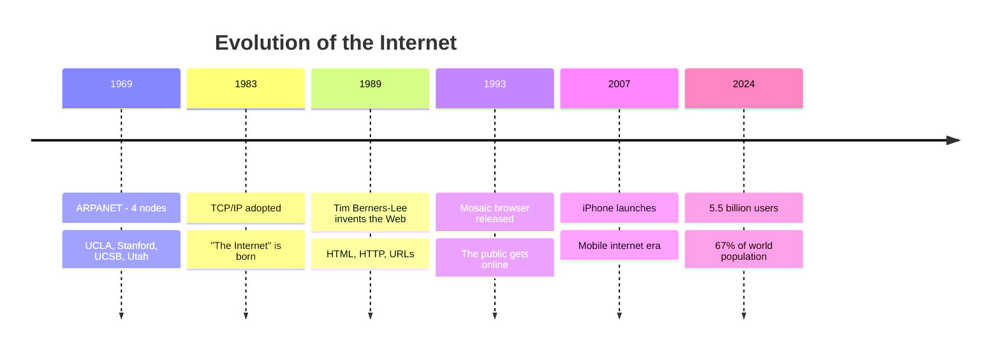

# How Does the Internet Work?

From clicking a link to loading a page — what actually happens?

<div class="pt-12">
  <span class="px-2 py-1 rounded cursor-pointer" hover="bg-white bg-opacity-10">
    CodeSeoul 🇰🇷
  </span>
</div>

---
transition: fade-out
---

# What We'll Cover

<v-clicks>

1. 🌍 What *is* the Internet, really?
2. 🔌 Physical infrastructure — cables, routers, data centers
3. 🏠 IP addresses — the Internet's postal system
4. 📖 DNS — the Internet's phone book
5. 📦 Packets & routing — how data actually travels
6. 📚 The TCP/IP stack — layers of communication
7. 🌐 HTTP/HTTPS — the language of the web
8. 🔄 Putting it all together — the life of a web request

</v-clicks>

---
layout: section
---

# Part 1
## What *is* the Internet?

---

# Not Magic — Just Wires (Mostly)

The Internet is a **global network of networks** — billions of devices connected together.

<v-clicks>

- It is **not** the World Wide Web (the Web is just one application that runs *on* the Internet)
- It is **not** "the cloud" — the cloud is just someone else's computer
- It **is** a set of agreed-upon protocols that allow any device to talk to any other device

</v-clicks>

<br>

<v-click>

> "The Internet is a network of networks. That's it. That's the tweet."

</v-click>

---

# A Very Brief History



---
layout: section
---

# Part 2
## Physical Infrastructure

---

# It's Cables All the Way Down

<div class="grid grid-cols-2 gap-4">
<div>

### Undersea Cables
- ~550 active submarine cables worldwide
- Carry **99%** of intercontinental data
- Up to 25,000 km long
- Fiber optic, diameter of a garden hose

### Last Mile
- Fiber optic (FTTH)
- Coaxial cable (cable internet)
- Copper (DSL — the old way)
- Wireless (4G/5G, WiFi, satellite)

</div>
<div>

```
                    🌐
              ╱      |      ╲
         IXP ——— IXP ——— IXP
        ╱   ╲     |     ╱   ╲
      ISP   ISP  ISP  ISP   ISP
       |     |    |    |      |
      🏠    🏢   🏠   📱    🏠
```

**IXP** = Internet Exchange Point
**ISP** = Internet Service Provider

</div>
</div>

---

# Key Physical Components

| Component | What It Does | Example |
|-----------|-------------|---------|
| **Modem** | Converts signals between your network and ISP | Your home modem |
| **Router** | Forwards packets between networks | Home WiFi router, Cisco enterprise |
| **Switch** | Connects devices within a local network | Office network switch |
| **Server** | Hosts content and services | A machine in a data center |
| **IXP** | Where different networks exchange traffic | KINX in Seoul 🇰🇷 |

<v-click>

<br>

> 🇰🇷 **Fun fact:** South Korea has some of the world's fastest internet, averaging ~200 Mbps. Most of Seoul is connected via FTTH (Fiber to the Home).

</v-click>

---
layout: section
---

# Part 3
## IP Addresses

---

# Every Device Gets an Address

An **IP address** is a unique identifier for a device on a network — like a postal address.

<div class="grid grid-cols-2 gap-8 mt-4">
<div>

### IPv4
```
192.168.1.1
```
- 4 groups of numbers (0–255)
- ~4.3 billion possible addresses
- **We ran out!** 😱

</div>
<div>

### IPv6
```
2001:0db8:85a3:0000:0000:8a2e:0370:7334
```
- 8 groups of hex numbers
- 340 undecillion addresses
- That's 3.4 × 10³⁸

</div>
</div>

<v-click>

<br>

### Public vs Private IPs

Your home router has **one public IP** from your ISP. Devices inside your home get **private IPs** (like `192.168.x.x`). Your router uses **NAT** (Network Address Translation) to map between them.

</v-click>

---

# How NAT Works

```
    Your Home Network                    The Internet
    ┌────────────────┐                  ┌──────────────┐
    │ 📱 192.168.1.2 │                  │              │
    │ 💻 192.168.1.3 │──► Router ──────►│  Web Server  │
    │ 🎮 192.168.1.4 │   Public IP:     │  93.184.216.34│
    └────────────────┘   203.0.113.5    └──────────────┘
         Private IPs         ▲
                             │
                    NAT translates:
                    192.168.1.3:54321
                    ↔ 203.0.113.5:54321
```

All your devices share **one public IP** — the router keeps track of which internal device made which request.

---
layout: section
---

# Part 4
## DNS — The Phone Book

---

# Nobody Remembers IP Addresses

**DNS** (Domain Name System) translates human-readable names into IP addresses.

```
codeseoul.org  →  DNS lookup  →  185.199.108.153
```

<v-clicks>

### The DNS Hierarchy

```
                    . (Root)
                 ╱     |     ╲
              .com   .org   .kr
              ╱        |       ╲
         google    codeseoul   naver
```

1. Your browser asks: "What's the IP for `codeseoul.org`?"
2. **Recursive resolver** (usually your ISP) starts the hunt
3. Asks **root server** → "Try the `.org` server"
4. Asks **.org server** → "Try this nameserver for `codeseoul.org`"
5. Asks **authoritative nameserver** → "Here's the IP: `185.199.108.153`"
6. Result is **cached** so we don't repeat this every time

</v-clicks>

---

# DNS in Action

```bash
# Try this at home!
$ nslookup codeseoul.org
Server:  dns.google
Address: 8.8.8.8

Name:    codeseoul.org
Address: 185.199.108.153

# Or dig for more detail
$ dig codeseoul.org

;; ANSWER SECTION:
codeseoul.org.    3600    IN    A    185.199.108.153

# TTL = 3600 seconds (1 hour) — how long to cache this answer
```

<v-click>

### Common DNS Record Types

| Type | Purpose | Example |
|------|---------|---------|
| **A** | Domain → IPv4 address | `codeseoul.org → 185.199.108.153` |
| **AAAA** | Domain → IPv6 address | `google.com → 2607:f8b0:4004:...` |
| **CNAME** | Domain → another domain (alias) | `www.example.com → example.com` |
| **MX** | Mail server for the domain | `codeseoul.org → mail.google.com` |

</v-click>

---
layout: section
---

# Part 5
## Packets & Routing

---

# Data Travels in Packets

You don't send a whole file at once — it gets broken into **packets**.

<div class="mt-4">

```
Original message: "Hello, CodeSeoul! How's it going?"

┌──────────┐  ┌──────────┐  ┌──────────┐  ┌──────────┐
│ Packet 1 │  │ Packet 2 │  │ Packet 3 │  │ Packet 4 │
│ "Hello, " │  │"CodeSeoul"│  │"! How's " │  │"it going?"│
│ Seq: 1   │  │ Seq: 2   │  │ Seq: 3   │  │ Seq: 4   │
│ From: A  │  │ From: A  │  │ From: A  │  │ From: A  │
│ To: B    │  │ To: B    │  │ To: B    │  │ To: B    │
└──────────┘  └──────────┘  └──────────┘  └──────────┘
```

</div>

<v-clicks>

- Each packet can take a **different route** to the destination
- Packets may arrive **out of order** — that's fine, they get reassembled
- If a packet is **lost**, only that packet needs to be resent

</v-clicks>

---

# How Routers Make Decisions

Each router looks at the **destination IP** and decides: "Where should I send this next?"

```
        📱 You (Seoul)
         │
    ┌────▼────┐
    │ Router 1│ ──► "Destination is in the US..."
    │ (KT/SKT)│
    └────┬────┘
         │
    ┌────▼────┐
    │  KINX   │ ──► "Route via Pacific submarine cable"
    │ (Seoul) │
    └────┬────┘
         │ ≈ 10,000 km undersea cable
    ┌────▼────┐
    │ Router  │ ──► "Almost there, forward to local network"
    │  (LA)   │
    └────┬────┘
         │
    ┌────▼────┐
    │ Server  │ ──► Destination reached!
    │(Oregon) │
    └─────────┘
```

<v-click>

This whole trip takes about **~120ms** (round trip) — you barely notice it.

</v-click>

---

# Traceroute — See the Path

```bash
# Watch packets hop across the world!
$ traceroute google.com

 1  192.168.1.1     (1 ms)     # Your router
 2  10.0.0.1        (5 ms)     # ISP local
 3  72.14.215.69    (8 ms)     # ISP backbone
 4  108.170.242.97  (12 ms)    # Google edge (Seoul)
 5  216.58.220.110  (15 ms)    # Google server

# From Seoul to Google: 5 hops, 15ms
# Thanks to CDNs and edge servers nearby!
```

<v-click>

### Why Some Websites Feel Slow

- **Physical distance** — speed of light in fiber ≈ 200,000 km/s
- **Too many hops** — each router adds latency
- **Congestion** — too much traffic at a router
- **CDNs help!** — Content Delivery Networks put copies of data closer to you

</v-click>

---
layout: section
---

# Part 6
## The TCP/IP Stack

---

# Layers of Communication

Think of it like sending a physical letter ✉️

<div class="mt-4">

| Layer | Name | Job | Analogy |
|-------|------|-----|---------|
| 4 | **Application** | What you want to say | Writing the letter |
| 3 | **Transport** | Reliable delivery | Registered mail vs postcard |
| 2 | **Internet** | Addressing & routing | Postal address |
| 1 | **Link** | Physical transmission | The mail truck |

</div>

<v-click>

```
Sending                                    Receiving
┌─────────────┐                           ┌─────────────┐
│ Application │  HTTP "GET /index.html"    │ Application │
├─────────────┤                           ├─────────────┤
│  Transport  │  TCP: port 443, seq #1    │  Transport  │
├─────────────┤                           ├─────────────┤
│  Internet   │  IP: src→dst address      │  Internet   │
├─────────────┤                           ├─────────────┤
│    Link     │  Ethernet/WiFi frame      │    Link     │
└──────┬──────┘                           └──────▲──────┘
       └──────── Physical medium ────────────────┘
```

</v-click>

---

# TCP vs UDP

<div class="grid grid-cols-2 gap-8">
<div>

### TCP — Transmission Control Protocol
**Reliable, ordered delivery**

- Three-way handshake (SYN → SYN-ACK → ACK)
- Guarantees all data arrives
- Guarantees correct order
- Retransmits lost packets
- Slower but dependable

**Used for:** Web browsing, email, file transfer, APIs

</div>
<div>

### UDP — User Datagram Protocol
**Fast, fire-and-forget**

- No handshake
- No guarantee of delivery
- No guarantee of order
- No retransmission
- Fast and lightweight

**Used for:** Video streaming, gaming, VoIP, DNS lookups

</div>
</div>

<v-click>

<br>

> **Analogy:** TCP is like a phone call (connection established, back-and-forth). UDP is like shouting across a room (fast, but you might miss something).

</v-click>

---

# The TCP Handshake

```
    Client                          Server
      │                               │
      │──── SYN (seq=100) ───────────►│  "Hey, want to talk?"
      │                               │
      │◄─── SYN-ACK (seq=300,ack=101)│  "Sure! I hear you."
      │                               │
      │──── ACK (ack=301) ───────────►│  "Great, let's go!"
      │                               │
      │       Connection established   │
      │◄─────── Data exchange ────────►│
      │                               │
      │──── FIN ─────────────────────►│  "I'm done."
      │◄─── ACK ──────────────────────│  "OK, bye."
      │                               │
```

This happens every time you open a web page — in about **~1ms** on a local network.

---
layout: section
---

# Part 7
## HTTP/HTTPS

---

# HTTP — The Language of the Web

**HyperText Transfer Protocol** — how your browser talks to web servers.

```http
# REQUEST (what your browser sends)
GET /meetups HTTP/1.1
Host: codeseoul.org
Accept: text/html
User-Agent: Chrome/120

# RESPONSE (what the server sends back)
HTTP/1.1 200 OK
Content-Type: text/html
Content-Length: 4523

<!DOCTYPE html>
<html>
  <head><title>CodeSeoul Meetups</title></head>
  <body>...</body>
</html>
```

---

# HTTP Methods & Status Codes

<div class="grid grid-cols-2 gap-8">
<div>

### Methods (Verbs)
| Method | Purpose |
|--------|---------|
| **GET** | Retrieve data |
| **POST** | Submit/create data |
| **PUT** | Update (replace) data |
| **PATCH** | Update (partial) data |
| **DELETE** | Remove data |

</div>
<div>

### Status Codes
| Code | Meaning |
|------|---------|
| **200** | OK ✅ |
| **301** | Moved permanently ↪️ |
| **404** | Not found 🔍 |
| **403** | Forbidden 🚫 |
| **500** | Server error 💥 |
| **418** | I'm a teapot 🫖 |

</div>
</div>

<v-click>

<br>

> **418 I'm a Teapot** is a real HTTP status code from an April Fools' RFC. It means the server refuses to brew coffee because it is, in fact, a teapot.

</v-click>

---

# HTTPS — HTTP + Security

**HTTPS** wraps HTTP in **TLS** (Transport Layer Security) encryption.

```
Without HTTPS (HTTP):
📱 ──── "password123" ────────► 🖥️
              👀 Anyone can read this!

With HTTPS:
📱 ──── "k8$#f!x@mQ2..." ────► 🖥️
              🔒 Encrypted — unreadable!
```

<v-clicks>

### The TLS Handshake (simplified)
1. **Client Hello** — "I support these encryption methods"
2. **Server Hello** — "Let's use this one. Here's my certificate."
3. **Certificate Verify** — Client checks: "Is this certificate legit?" (via Certificate Authority)
4. **Key Exchange** — Both sides generate a shared secret key
5. **Encrypted Session** — All data is now encrypted with that key

</v-clicks>

<v-click>

> 🔒 Always check for the lock icon in your browser! No lock = your data is visible to anyone on the network.

</v-click>

---
layout: section
---

# Part 8
## Putting It All Together

---

# The Life of a Web Request

What happens when you type `codeseoul.org` and press Enter?

<v-clicks>

1. **Browser checks cache** — "Have I been here recently?"
2. **DNS lookup** — `codeseoul.org` → `185.199.108.153`
3. **TCP handshake** — SYN → SYN-ACK → ACK (establish connection)
4. **TLS handshake** — Exchange certificates, establish encryption
5. **HTTP request** — `GET / HTTP/1.1` (send the request)
6. **Server processes** — Server finds the page, builds the HTML
7. **HTTP response** — Server sends back HTML, CSS, JS, images
8. **Browser renders** — Parse HTML → Build DOM → Apply CSS → Execute JS
9. **Sub-requests** — Browser fetches images, fonts, scripts (repeat steps 2-8)
10. **Page complete!** — You see the CodeSeoul website 🎉

</v-clicks>

<v-click>

**Total time: ~200–500ms** for a well-optimized site

</v-click>

---

# Let's Watch It Happen

Open DevTools (F12) → Network tab → Visit any website

```
Name              Status  Type       Size     Time
─────────────────────────────────────────────────────
codeseoul.org     200     document   4.5 KB   120 ms
style.css         200     stylesheet 2.1 KB    45 ms
app.js            200     script     8.3 KB    62 ms
logo.png          200     image      15 KB     38 ms
font.woff2        200     font       24 KB     55 ms
analytics.js      200     script     3.2 KB    89 ms
─────────────────────────────────────────────────────
6 requests | 57.1 KB transferred | 310 ms total
```

<v-click>

### Try it yourself! 🧪

1. Open Chrome → F12 → Network tab
2. Visit `codeseoul.org`
3. Watch every request in real time
4. Click any request to see headers, response, timing

</v-click>

---
layout: two-cols
---

# Review: Key Takeaways

<v-clicks>

✅ The Internet is a **network of networks** using agreed-upon protocols

✅ Data travels through **physical cables** (mostly undersea fiber)

✅ **IP addresses** identify devices; **DNS** translates names to IPs

✅ Data is split into **packets** that can take different routes

✅ **TCP** ensures reliable delivery; **UDP** prioritizes speed

✅ **HTTP** is how browsers talk to servers; **HTTPS** adds encryption

✅ A single page load involves **many steps** happening in milliseconds

</v-clicks>

::right::

<div class="ml-8 mt-12">

# Want to Explore More?

<v-clicks>

🔧 **Tools to try:**
- `nslookup` / `dig` — DNS lookups
- `traceroute` / `tracert` — Trace packet routes
- `ping` — Test connectivity
- Browser DevTools (F12) — Watch network traffic
- Wireshark — Deep packet inspection

📚 **Resources:**
- [How DNS Works (comic)](https://howdns.works/)
- [Submarine Cable Map](https://www.submarinecablemap.com/)
- [MDN Web Docs: HTTP](https://developer.mozilla.org/en-US/docs/Web/HTTP)

</v-clicks>

</div>

---
layout: center
class: text-center
---

# Thank You!

Questions? 🙋

<br>

**CodeSeoul** — [codeseoul.org](https://codeseoul.org)

<div class="pt-8 text-sm opacity-60">

Slides made with [Slidev](https://sli.dev) 💚

</div>
